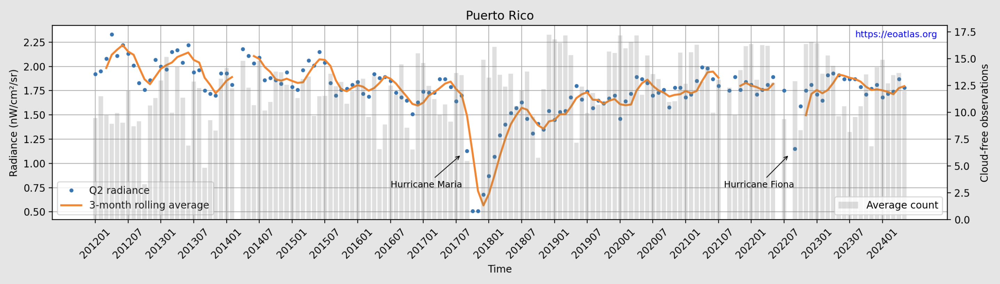

# Earth Observation Atlas
[](https://creativecommons.org/licenses/by/4.0/)


# Global Scale Nightlight Time Series Dataset


Use this [code](examples/20240624_puerto-rico-hurricane-maria.ipynb) to reproduce graph.

# Summary
- Analysis-ready dataset of monthly [nighttime lights](https://www.earthdata.nasa.gov/technology/nighttime-lights) derived from the [VIIRS](https://en.wikipedia.org/wiki/Visible_Infrared_Imaging_Radiometer_Suite) instrument aboard the [SNPP](https://en.wikipedia.org/wiki/Suomi_NPP) satellite.

- Nightlight is calculated at the administrative unit level (ADM 0~2) for [208 countries and territories](docs/data/ACCESS_DATA.md), totaling 52,702 administrative units worldwide.

- Administrative units are each represented by a time series (sequence of monthly observations) for the period between January 2012 and May 2024.

- The dataset is updated regularly and hosted publicly on AWS.


# Download
Click [here](data/ACCESS_DATA.md) to access the dataset.


<!-- # Examples
TBD -->


# Schema
Individual `.csv` files, one per administrative unit, adhere to the following schema:

| Column | Data type | Description |
| ------ | --------- | ----------- |
| `year` | `int` | Year of observation.|
| `month` | `int` | Month of observation.|
| `shapeName` | `string` | Name of administrative unit<sup>1</sup>.|
| `shapeType` | `string` | Type of administrative unit<sup>1</sup>.|
| `shapeGroup` | `string` | Group to which administrative unit belongs<sup>1</sup>.|
| `min` | `float` | Minimum nightlight.|
| `max` | `float` | Maximum nightlight.|
| `mean` | `float` | Mean nightlight.|
| `q1` | `float` | First quartile.|
| `q2` | `float` | Second quartile (Median).|
| `q3` | `float` | Third quartile.|
| `std` | `float` | Standard deviation.|
| `sum` | `float` | Nightlight sum.|
| `unit` | `string` | Unit of nightlight.|
| `count` | `int`| Number of pixels within administrative unit boundary.|
| `cloudFree` | `float` | Average number of cloud-free observations per pixel.|

<sup>1</sup>See [geoBoundaries](https://www.geoboundaries.org/) for details.


# Pre-processing

## (A) Raster data
1. Monthly composites (`DNB_npp_*-slcorr_v10_*.avg_rade9.tif`) and cloud-free masks (`DNB_npp_*-slcorr_v10_*.n_cf.tif`) are sourced from [Light Every Night (LEN)](https://worldbank.github.io/OpenNightLights/wb-light-every-night-readme.html) on AWS.
2. `nodata` pixels (-1.5 and -999.3) are set to `numpy.nan`.

## (B) Vector data
1. Global boundaries with three levels of administrative divisions (ADM0~2) are sourced from [geoBoundaries](https://www.geoboundaries.org/).
2. Level 2 boundaries are mapped to their parent level 1 polygons via intersection.
3. This vector layer is used below to extract zonal statistics from the raster layer.

## (C) Time series generation
1. Zonal stats (`min`, `max`, etc.) at the administrative unit level are extracted from the raster layer above using [`rasterstats`](https://pypi.org/project/rasterstats/) library with the `all_touched` flag set to `False`.
2. `cloudFree` column is calculated from the cloud-free mask using the same approach described in step 1.
3. Extracted time series data are written to individual `.csv` files and uploaded to `S3` on AWS.


# Known Issues
1. Orphan ADM2 boundaries listed under `Null` due to polygon intersection failure. See [here](data/00001.md) for an example.

2. Missing data: data missing from the [source](https://worldbank.github.io/OpenNightLights/wb-light-every-night-readme.html) (03/2014, 08/2021, 06/2022 and 08/2022 are replaced with `numpy.nan` in the final dataset.

3. Missing masks: cloud-free masks missing from the source (10/2017 and 11/2017) are replaced with `numpy.nan` accordingly.


# Cite
This dataset is made available under the [CC BY 4.0 license](https://creativecommons.org/licenses/by/4.0/), requiring acknowledgment in any products that use it.

*Written works*:

```
Najjar, A. (2024). Global scale nightlight time series dataset. https://nightlight.eoatlas.org.
```

*Online use*:

Make sure to mention `Earth Observation Atlas` as the source and link to https://eoatlas.org.
